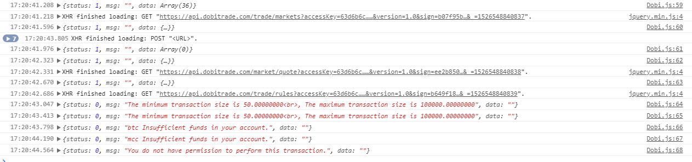

# README

## 参考文档

* https://github.com/ccxt/ccxt
* [Dobi](https://api.dobitrade.com/#api_block)
* [Coinbene](https://github.com/Coinbene/API-Documents-CHN/wiki/0.0.0-Coinbene-API%E6%96%87%E6%A1%A3)

## Node.js Version

* [CupLab.browser.js](js/CupLab.browser.js):
  * support `jquery`;
  * support `underscore`;
  * support `crypto`;
  * support `Dobi`;
  * support `Coinbene`;
* Coinbene:
  * [Source Code](nodejs2browserify/Coinbene);
* Dobi:
  * [Source Code](nodejs2browserify/Dobi);

## 使用方法

* [main.js](js/main.js)
